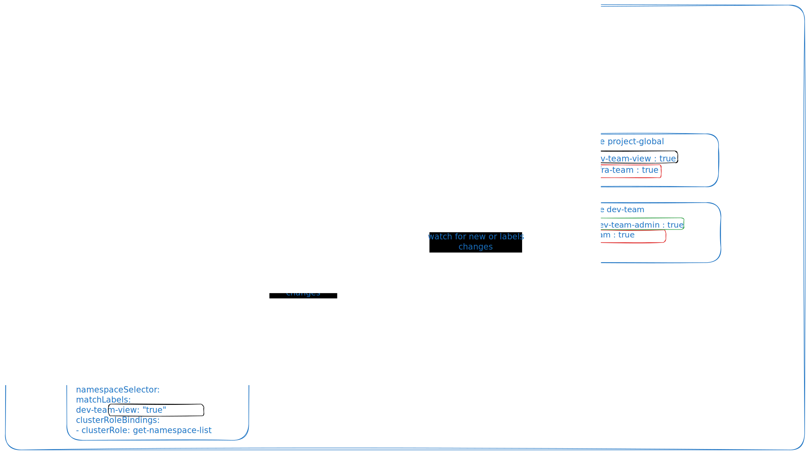

RBACManager was a really useful Kubernetes operator that I have been using professionally with dynamic label. I am going here to try to explain its functionning. It works by managing RBAC definition objects and control them via the Kube API by watching any creation, update, deletion of RBAC definition.

The operator watches on the API Server for few ressources :
- The RBACDefinition (its custom CRD)
- The Namespaces (to detect label changes)
- The Cluster and Role Bindings (to detect drift)

When one of those objects are created/modified, the API server will send an event to the controller, to reconciliate with the current situation. It will then create or delete the right role bindings in the corresponding namespaces 

What is a RBACDefinition object? A RBACdefinition is a a custom resource definition allowing to manage on a unified way the Roles and RolesBinding. It allows you to define multiple users, groups, or service accounts and map them to various roles across different namespaces—all within a single YAML file.

An RBACDefinition uses an array called RBACBindings, that mapped essentially groups Subjects (who (which group? user?)) with an RoleBinding (A mapping between a cluster Role and a namespace or a label on a namespace) and/or ClusterRoleBindings (same as RoleBinding, but cluster wide)

## For the example on the scheme on two teams (one infra team and one dev team) sharing the cluster : 

We have the what, where and who in the RBAC definition :

- **`subjects`** — the user or external group (here `infra-team` and `dev-team`, which could come which could come from an IdP if OIDC integration is configured on the cluster.

- **`roleBindings`** — the *what and where, scoped to namespaces*. Each entry references an existing ClusterRole (`Admin`, `View`) and uses a `namespaceSelector` instead of a hardcoded namespace: it will create the right RoleBinding only on namespaces matching the labels described under `namespaceSelector`.

- **`clusterRoleBindings`** — the *what, cluster-wide*. Used here to give both teams the minimal `get-namespace-list` ClusterRole so they can at least list all namespaces.

---

### What actually gets created

If we take back the scheme, the cluster has these namespaces with labels:

| Namespace        | Labels                                         |
|------------------|------------------------------------------------|
| `project-global` | `infra-team: "true"`, `dev-team-view: "true"`  |
| `dev-team`       | `dev-team-admin: "true"`, `infra-team: "true"` |

The RBAC Manager resolves each `namespaceSelector` and produces:

**From `infra-team`:**
- `RoleBinding` in `project-global` → `Admin` for group `infra-team` (matches `infra-team=true`)
- `RoleBinding` in `dev-team` → `Admin` for group `infra-team` (matches `infra-team=true`)
- `ClusterRoleBinding` → `get-namespace-list` for group `infra-team`

**From `dev-team`:**
- `RoleBinding` in `project-global` → `View` for group `dev-team` (matches `dev-team-view=true`)
- `RoleBinding` in `dev-team` → `Admin` for group `dev-team` (matches `dev-team-admin=true`)
- `ClusterRoleBinding` → `get-namespace-list` for group `dev-team`

---

### Why this is powerful with dynamic labels

Add a new namespace tomorrow with `infra-team: "true"`, and the infra team instantly gets `Admin` access — no YAML change, no redeploy. Flip a label off, the corresponding `RoleBinding` is reaped on the next reconciliation loop. The label becomes the contract; the RBAC follows automatically.

