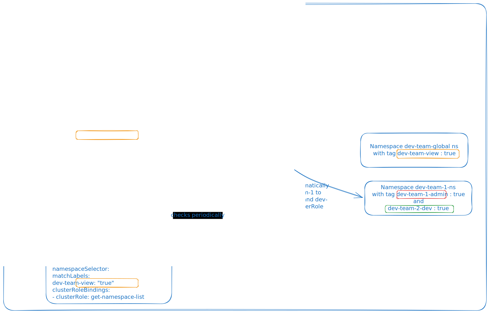

RBACManager was a really useful Kubernetes operator that I have been using professionally with dynamic label. I am going here to try to explain its functionning. It works by managing RBAC definition objects and control them via the Kube API by watching any creation, watch, deletion of RBAC definition.

What is a RBAC definition? A RBACdefinition is a a custom resource definition allowing to manage on a unified way the Roles and RolesBinding. It allows you to define multiple users, groups, or service accounts and map them to various roles across different namespaces—all within a single YAML file.

An RBACDefinition essentially groups Subjects (who (which group? user?)) with Binding (what (What role) and where (which namespace or the whole cluster?)) under an array called rbacBindings.

## For the example on the scheme on twio devs team sharing the cluster : 

We have the what, where and who in the RBAC definition :
- **`subjects`** — an external group (here dev-team-1 and dev-team-2 that could come from an Identity provider).
- **`roleBindings`** — the *what and where, scoped to namespaces*. Each entry references an existing default ClusterRole (View and Admin) and uses a namespaceSelector instead of a hardcoded namespace : basically it will create the right role and the binding only on the namespaces labeled with what described below namespaceSelector. 
- **`clusterRoleBindings`** — the *what, cluster-wide*. Used here to give both teams a minimal cluster global role `get-namespace-list` permission so they can at least see all the namespaces. 

### What actually gets created

Assume the cluster has these namespaces with labels:

With these namespaces:

| Namespace            | Labels                                                |
|----------------------|-------------------------------------------------------|
| `dev-team-global-ns` | `dev-team-view: "true"`                               |
| `dev-team-1-ns`      | `dev-team-1-admin: "true"`, `dev-team-2-dev: "true"`  |

The RBAC Manager resolves each "namespaceSelector" and it produces:

**From `dev-team-2`:**
- `RoleBinding` in `dev-team-1-ns` → `dev` for group `dev-team-2` (matches `dev-team-2-dev=true`)
- `RoleBinding` in `dev-team-global-ns` → `view` for group `dev-team-2` (matches `dev-team-view=true`)
- `ClusterRoleBinding` → `get-namespace-list` for group `dev-team-2`

### Why this is powerful with dynamic labels

Add a new namespace tomorrow with `dev-team-view: "true"`, and both teams instantly get `view` access** — no YAML change, no redeploy. Flip a label off, the corresponding `RoleBinding` is reaped on the next reconciliation loop. The label becomes the contract; the RBAC follows automatically.

