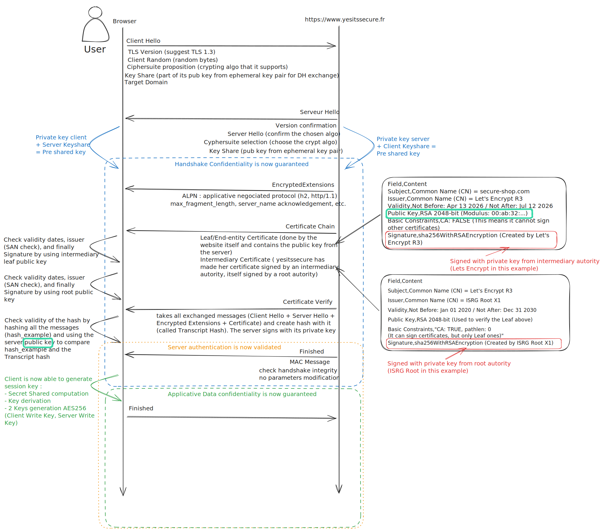

# TLS 1.3 Handshake

This folder is about me trying to explain TLS 1.3 and the flow we do every day when browsing on Internet. This protocol aims to encrypt and authenticate communication with web servers. It follows a client-server mode, allowing:

- **Server authentication**
- **Data confidentiality**
- **Data integrity** over data exchanged
- **Client authentication** (optional, mTLS)

Let's detail the flow I did on the scheme — not all the parameters are detailed here in the flow or on the scheme, but I tried to put the most important ones.

---



---

## 1. Client Hello

When we type `https://yesitssecure.fr` (this name domain does not exist by the way, well done to me for choosing the right example) we first send a **Client Hello** message to the web server. This message is **in clear text** and contains a few informations that the server will need:

- The **TLS version** the client wants.
- **Random bytes** that will be useful against replay attacks
- A few **extensions** that are really important, such as:
    - `key_share`: the client already generates one or more ephemeral DH pairs and sends its public key(s) for the groups it deems likely. That's how, in one RTT, the confidentiality will be guaranteed.
    - `supported_groups`: the supported DH groups / elliptic curves.
    - some **signature algorithms** that the client will accept for the certificates it will verify.
    - the **target domain** (SNI)

---

## 2. Server Hello

The server processes the information and replies. Still **in the clear**, because the client can't decrypt yet.

It replies with:

- The TLS version confirmation** (in our case 1.3)
- Still the **random 32 bytes** from the server
- The **server `key_share`**: the server has generated its own ephemeral DH pair in the chosen group and returns its public key
- The **ciphersuite selection**: the suite chosen among those offered

Now both parties can compute a shared secret because as soon as the ServerHello is received, both sides possess:

- their own ephemeral **private key**,
- the other's ephemeral **public key**.

Each computes `ECDHE(my_private, their_public)` → the same **shared secret** (a mathematical property of Diffie-Hellman), without that secret ever traveling over the network. This secret feeds the **HKDF** (HMAC-based Key Derivation Function) that we won't detail here, but that allows us to have a secret to encrypt all subsequent messages.

---

## 3. EncryptedExtensions (←, handshake-encrypted)

Now the server is going to send a few messages to the client. It starts with the **EncryptedExtensions**, which contains the negotiated extensions that don't need to be in the clear:

- **ALPN**: the single protocol the server picked from the client's offered list — e.g. `h2` (HTTP/2) or `http/1.1`.
- **Server name ack**: that the server processed the SNI (no value, just confirmation).
- **`max_fragment_length`**: negotiated record sizing, useful for constrained clients.

Being encrypted hides this metadata from a network observer.

---

## 4. Certificate (←, handshake-encrypted)

The server sends the **certificate chain**. It contains:

- A `certificate_request_context` field (empty in a normal handshake, used for client auth).
- A list of entries, each = a DER certificate + its extensions:

```
└── certificate_list  (ordered, leaf first)
      ├── [0] leaf certificate (DER) + per-cert extensions
      │        • the server public key
      │        • the SANs (www.yesitssecure.fr)
      │        • validity dates, issuer, key usage
      │        • extensions
      │          SCTs (Certificate Transparency)
      ├── [1] intermediate CA (DER) + extensions
      └── [2] (possibly more intermediates)
            ── root NOT included (client already trusts it)
```

---

## 5. Certificate validity check (client side only)

When the client receives the chain, it checks the static certificate data:

- **Signature chain**: the leaf's signature verifies against the intermediate's public key; the intermediate's signature verifies against the root's public key; the root is present in the client's trust store. Each link uses the issuer's public key to verify the subject's signature.
- **Name matching**: one of the leaf's SANs matches the domain the client intended (`yesitssecure.fr` here). A cert valid for a different name fails here.
- **Time validity window**: current time is within the leaf's `not-before` / `not-after` dates.
- **A few constraints**: key usage, basic constraints (is this intermediate actually allowed to sign certs?), path length, etc.

Those signatures guarantee that there exists a **valid, trusted, unexpired, correctly-named certificate** binding this public key to this domain.

> ⚠️ But anyone could have grabbed it and use it the same way, so it does **not** guarantee at all that we are talking with the owner of the leaf certificate's private key. So the next message sent by the server will verify that.

---

## 6. CertificateVerify (←, handshake-encrypted)

The message that answers the question above. In this part, the server **proves it holds the private key** associated with the leaf.

**Mechanism:** the server takes the **transcript hash** = hash of all handshake messages exchanged so far (ClientHello, ServerHello, EncryptedExtensions, Certificate…). It signs this hash with its private key, using one of the signature algorithms the client advertised in its `signature_algorithms` extension back in **step 1** (ClientHello).

---

## 7. Signature verification

The client hashes on its side those messages also and verifies the server's signature with the leaf's public key (extracted from the certificate in step 5).

If it verifies → the server does hold the right private key, and an attacker who copied the public certificate can't produce this signature. ✅

---

## 8. Server Finished (←, handshake-encrypted)

An **HMAC** computed over the whole transcript, with a key derived from the `server_handshake_traffic_secret` (the `finished_key`).

The role of this step is just to **guarantee the integrity of the entire handshake**. If a bit had been altered en route by anything, the computation on the client side for the HMAC wouldn't match.

After sending its Finished, the server can already derive the application keys and start sending application data (hence **1-RTT** on the server side).

---

## 9. Client Finished (→, handshake-encrypted)

The client has:

- validated the certificate chain (5.),
- verified the CertificateVerify (7.),
- verified the server Finished (8.).

It computes its own **Finished** (HMAC of the transcript with its key) and sends it. This seals the handshake on the client side and proves to the server that the client received everything intact.

> 💡 **Optional (mTLS):** if the server had sent a `CertificateRequest`, the client inserts its own `Certificate` + `CertificateVerify` here — that's **mutual authentication**.

---

## 10. Application key derivation + Application Data (↔, application-encrypted)

Once the Finished messages are exchanged, the HKDF key schedule derives the **Master Secret**, then:

```
Handshake Secret ─► HKDF ─► Master Secret
                              │
                              ├─► client_application_traffic_secret
                              └─► server_application_traffic_secret
```

These secrets produce the **AEAD keys** (e.g. `AES-128-GCM`) that encrypt the real application traffic (the HTTP).

> 🔑 These keys are **distinct** from the handshake ones: compromising one doesn't compromise the other.
