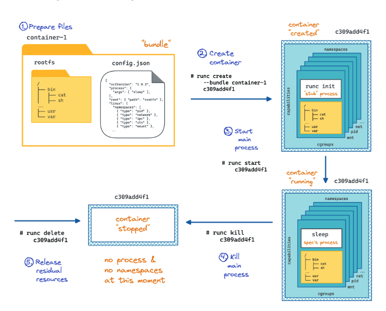

# Create and Start a Container Manually With runc

This challenge was a Hard iximiuz challenge that was really useful for me to understand container runtime a bit more, their role and more globally the functionning of container themselves.

Challenge link : https://labs.iximiuz.com/challenges/start-container-with-runc

The goal of the channel was to create, start, access, and then destroy an Nginx container using the runc CLI. The following steps are required to achieve this:

1. Prepare a container root filesystem.
2. Prepare a container configuration file.
3. Create a container using the runc CLI.
4. Configure the container networking.
5. Start the container using the runc CLI.
6. Make sure it's accessible from the host.
7. Terminate the container and clean up the resources.



## First, what is runc?

Runc is a low-level tool written in Go used to start container that creates and run container by talking to the Linux kernel. We don't need to give him an image, this single command-line binary just need an OCI Bundle and it can then prepare runtime for containers, including the namespaces creation.

An OCI Bundle is composed of two elements :

- config.json file with all the container parameters to implement standard operations against the containers. (It declares namespaces, cgroups, mounts, capabilities, seccomp profile, the process to exec, UID/GID mappings, etc.)
- A folder with the said executable and supporting files (if any).

Just with that, Runc CLI is able to turn this bundle into a container.

A lot of container "features" are handled on a higher level than runc: such as image pull, image layers, image build, container networking, or container "tracking" about their state. Runc has no daemon, it just actually creates the container with all the elements needed and exits.

## 1. Prepare the bundle

The first step is to prepare the bundle with the config file and the root filesystem.

The command runc spec can generate a template of it and I also used this document to understand every field of it : https://github.com/opencontainers/runtime-spec/blob/68346ed538d50d73869d48edb009fb0c2d1dd66e/config.md

```console
root@docker-01:~# mkdir container-1
root@docker-01:~# cd container-1/
root@docker-01:container-1# runc spec
root@docker-01:container-1# ls
config.json
root@docker-01:container-1# cat config.json
```

```json
{
        "ociVersion": "1.2.1",
        "process": {
                "terminal": true,
                "user": {
                        "uid": 0,
                        "gid": 0
                },
                "args": [
                        "sh"
                ],
                "env": [
                        "PATH=/usr/local/sbin:/usr/local/bin:/usr/sbin:/usr/bin:/sbin:/bin",
                        "TERM=xterm"
                ],
                "cwd": "/",
                "capabilities": {
                        "bounding": [
                                "CAP_AUDIT_WRITE",
                                "CAP_KILL",
                                "CAP_NET_BIND_SERVICE"
                        ],
                        "effective": [
                                "CAP_AUDIT_WRITE",
                                "CAP_KILL",
                                "CAP_NET_BIND_SERVICE"
                        ],
                        "permitted": [
                                "CAP_AUDIT_WRITE",
                                "CAP_KILL",
                                "CAP_NET_BIND_SERVICE"
                        ]
                },
                "rlimits": [
                        {
                                "type": "RLIMIT_NOFILE",
                                "hard": 1024,
                                "soft": 1024
                        }
                ],
                "noNewPrivileges": true
        },
        "root": {
                "path": "rootfs",
                "readonly": true
        },
        "hostname": "runc",
        "mounts": [
                {
                        "destination": "/proc",
                        "type": "proc",
                        "source": "proc"
                },
                {
                        "destination": "/dev",
                        "type": "tmpfs",
                        "source": "tmpfs",
                        "options": [
                                "nosuid",
                                "strictatime",
                                "mode=755",
                                "size=65536k"
                        ]
                },
                {
                        "destination": "/dev/pts",
                        "type": "devpts",
                        "source": "devpts",
                        "options": [
                                "nosuid",
                                "noexec",
                                "newinstance",
                                "ptmxmode=0666",
                                "mode=0620",
                                "gid=5"
                        ]
                },
                {
                        "destination": "/dev/shm",
                        "type": "tmpfs",
                        "source": "shm",
                        "options": [
                                "nosuid",
                                "noexec",
                                "nodev",
                                "mode=1777",
                                "size=65536k"
                        ]
                },
                {
                        "destination": "/dev/mqueue",
                        "type": "mqueue",
                        "source": "mqueue",
                        "options": [
                                "nosuid",
                                "noexec",
                                "nodev"
                        ]
                },
                {
                        "destination": "/sys",
                        "type": "sysfs",
                        "source": "sysfs",
                        "options": [
                                "nosuid",
                                "noexec",
                                "nodev",
                                "ro"
                        ]
                },
                {
                        "destination": "/sys/fs/cgroup",
                        "type": "cgroup",
                        "source": "cgroup",
                        "options": [
                                "nosuid",
                                "noexec",
                                "nodev",
                                "relatime",
                                "ro"
                        ]
                }
        ],
        "linux": {
                "resources": {
                        "devices": [
                                {
                                        "allow": false,
                                        "access": "rwm"
                                }
                        ]
                },
                "namespaces": [
                        {
                                "type": "pid"
                        },
                        {
                                "type": "network"
                        },
                        {
                                "type": "ipc"
                        },
                        {
                                "type": "uts"
                        },
                        {
                                "type": "mount"
                        },
                        {
                                "type": "cgroup"
                        }
                ],
                "maskedPaths": [
                        "/proc/acpi",
                        "/proc/asound",
                        "/proc/kcore",
                        "/proc/keys",
                        "/proc/latency_stats",
                        "/proc/timer_list",
                        "/proc/timer_stats",
                        "/proc/sched_debug",
                        "/sys/firmware",
                        "/proc/scsi"
                ],
                "readonlyPaths": [
                        "/proc/bus",
                        "/proc/fs",
                        "/proc/irq",
                        "/proc/sys",
                        "/proc/sysrq-trigger"
                ]
        }
}
```

The second part is to get the filesystem of a nginx image, and it is not as easy as I tought it would be. Iximiuz labs has a full tutorial on it : https://labs.iximiuz.com/tutorials/extracting-container-image-filesystem

The technique we are going to use is to create a Docker file with only a nginx base image, then build the image and use the -o option to have the root filesystem in a rootfs folder

```console
root@docker-01:container-1# echo 'FROM ghcr.io/iximiuz/labs/nginx:alpine' > Dockerfile
root@docker-01:container-1# docker build -o rootfs .
[+] Building 3.3s (5/5) FINISHED                                docker:default
 => [internal] load build definition from Dockerfile                      0.0s
 => => transferring dockerfile: 76B                                       0.0s
 => [internal] load metadata for ghcr.io/iximiuz/labs/nginx:alpine        1.2s
 => [internal] load .dockerignore                                         0.0s
 => => transferring context: 2B                                           0.0s
 => [1/1] FROM ghcr.io/iximiuz/labs/nginx:alpine@sha256:65645c7bb6a06618  1.7s
 => => resolve ghcr.io/iximiuz/labs/nginx:alpine@sha256:65645c7bb6a06618  0.0s
 => => sha256:39c2ddfd6010082a4a646e7ca44e95aca9bf3eae 15.52MB / 15.52MB  0.9s
 => => sha256:34a64644b756511a2e217f0508e11d1a572085d66c 1.40kB / 1.40kB  0.6s
 => => sha256:197eb75867ef4fcecd4724f17b0972ab0489436860 1.21kB / 1.21kB  0.3s
 => => sha256:81bd8ed7ec6789b0cb7f1b47ee731c522f6dba83201ec7 402B / 402B  0.2s
 => => sha256:d7e5070240863957ebb0b5a44a5729963c3462666baa29 955B / 955B  0.3s
 => => sha256:b464cfdf2a6319875aeb27359ec549790ce14d8214fcb1 629B / 629B  0.3s
 => => sha256:61ca4f733c802afd9e05a32f0de0361b6d713b8b53 1.79MB / 1.79MB  0.4s
 => => sha256:f18232174bc91741fdf3da96d85011092101a032a9 3.64MB / 3.64MB  0.3s
 => => extracting sha256:f18232174bc91741fdf3da96d85011092101a032a93a388  0.2s
 => => extracting sha256:61ca4f733c802afd9e05a32f0de0361b6d713b8b53292dc  0.2s
 => => extracting sha256:b464cfdf2a6319875aeb27359ec549790ce14d8214fcb16  0.0s
 => => extracting sha256:d7e5070240863957ebb0b5a44a5729963c3462666baa294  0.0s
 => => extracting sha256:81bd8ed7ec6789b0cb7f1b47ee731c522f6dba83201ec73  0.0s
 => => extracting sha256:197eb75867ef4fcecd4724f17b0972ab0489436860a594a  0.0s
 => => extracting sha256:34a64644b756511a2e217f0508e11d1a572085d66cd6dc9  0.0s
 => => extracting sha256:39c2ddfd6010082a4a646e7ca44e95aca9bf3eaebc00f17  0.3s
 => exporting to client directory                                         1.9s
 => => copying files 48.08MB                                              0.3s
root@docker-01:container-1# ls
Dockerfile  config.json  rootfs
root@docker-01:container-1#
```

I need to tell runc what process to start inside the container, and this goes via modifying the config.json file in the args section.

```json
                "args": [
                        "nginx",
                        "-g",
                        "daemon off;"
                ]
```

## 2. Create the container

The bundle is now ready and can now create the container via runc CLI

This step will build the container fully without starting the process inside. It will:

- Read the bundle I created— config.json + rootfs.
- Create the 6 namespaces declared in my config.json file.
- Not write the UID/GID maps, (normally it does, but here I skipped it in my config file).
- Set up the cgroup and writes the resource limits.
- Pivot into the container's rootfs, mounts /proc, /sys, /dev.
- Mark mounts private, mounts the rootfs (read-only), then mounts everything in the mounts array
- Do few hardening on linux capabilities, device rules, etc.

```console
root@docker-01:container-1# runc create nginx
ERRO[0000] runc create failed: cannot allocate tty if runc will detach without setting console socket
```

I first had this error, related to terminal allocation. I switched the terminal from true to false as nginx is a typical server container.

```json
"terminal": false,
```

My container is now created :

```console
root@docker-01:container-1# runc create nginx
root@docker-01:container-1#
```

It is not running and is waiting to be started. there is a runc init process that we can observe with ps auxf command, and that is exactly the parked container init — it's the container sitting in the "created" state, frozen at the FIFO, waiting for runc start. (the runc process is blocked in it, waiting for another process to read in the FIFO, the runc start). The runc init is there also because the namespaces to exist, needs at least one process living.

Indeed, when runc create ran, it did all the setup inside a process, and that process is runc init — the little in-container init that's been carrying all the namespaces, capabilities, mounts, etc. runc init is the placeholder that will become nginx the moment I will call runc start. execve will replace the runc init program with nginx in this same process — same PID, new program.

## 3. Configure the networking

Before starting I had to do the networking part. I already spoke about how networking works for containers in the "Mini Local App Architecure/" Project. Here, we don't need to do everything with a bridge, sNAT (only one container, and the goal is not to have the exact networking of a container, but just to be communicating with it). We will simplify it by just using a veth pairs between the host and the container:

Create the veth pair

```console
root@docker-01:container-1# sudo ip link add veth0 type veth peer name veth1
```

Check the network namespace created by the runc create (only the loopback should appear right now)

```console
root@docker-01:container-1# sudo nsenter -n -t 30284 ip a
1: lo: <LOOPBACK,UP,LOWER_UP> mtu 65536 qdisc noqueue state UNKNOWN group default qlen 1000
    link/loopback 00:00:00:00:00:00 brd 00:00:00:00:00:00
    inet 127.0.0.1/8 scope host lo
       valid_lft forever preferred_lft forever
    inet6 ::1/128 scope host
       valid_lft forever preferred_lft forever
```

To get the right network namespace that has been created during the runc create, I found taht the namespace of a process (here it will be for runc init) are listed in this /proc/<pid>/ns/.

I put one veth in the right network namespace

```console
root@docker-01:container-1# sudo ip link set veth1 netns /proc/30284/ns/net
```

Upping both interfaces and giving them IP adresses

```console
root@docker-01:container-1# sudo nsenter -n -t 30284 ip addr add 192.168.0.2/24 dev veth1
root@docker-01:container-1# sudo nsenter -n -t 30284 ip link set veth1 up
root@docker-01:container-1# sudo ip addr add 192.168.0.1/24 dev veth0
root@docker-01:container-1# ip link set veth0 up
```

Checking in my network namespace if everyhting is correct:

```console
root@docker-01:container-1# sudo nsenter -n -t 30284 ip a
1: lo: <LOOPBACK,UP,LOWER_UP> mtu 65536 qdisc noqueue state UNKNOWN group default qlen 1000
    link/loopback 00:00:00:00:00:00 brd 00:00:00:00:00:00
    inet 127.0.0.1/8 scope host lo
       valid_lft forever preferred_lft forever
    inet6 ::1/128 scope host
       valid_lft forever preferred_lft forever
6: veth1@if7: <BROADCAST,MULTICAST,UP,LOWER_UP> mtu 1500 qdisc noqueue state UP group default qlen 1000
    link/ether 76:5e:2e:83:a5:a1 brd ff:ff:ff:ff:ff:ff link-netnsid 0
    inet 192.168.0.2/24 scope global veth1
       valid_lft forever preferred_lft forever
    inet6 fe80::745e:2eff:fe83:a5a1/64 scope link
       valid_lft forever preferred_lft forever
```

## 4. Start the container

It's now Timmmmmmmeeeee (like Bruce Buffer would say) to start the container. runc start is the command that unblocks the parked runc init process at the FIFO and lets execve replace its content with nginx, all in the same PID I saw earlier with ps auxf. From here the troubleshooting really started, as nginx complained at every layer of the sandbox I had built around it.

### First issue

```console
root@docker-01:container-1# runc start nginx
root@docker-01:container-1# 2026/07/14 15:39:34 [emerg] 1#1: mkdir() "/var/cache/nginx/client_temp" failed (30: Read-only file system)
nginx: [emerg] mkdir() "/var/cache/nginx/client_temp" failed (30: Read-only file system)
```

The first wall is the read-only root filesystem. In my config.json the root was declared with "readonly": true, but nginx needs to create its cache directories under /var/cache/nginx at startup. Since the whole rootfs is mounted read-only, that mkdir() command is rejected by the kernel. The fix is to flip the root filesystem to writable so nginx can set up its runtime directories.

In the config.json :

```json
"readonly": false,
```

### Second issue

```console
root@docker-01:container-1# runc start nginx
root@docker-01:container-1# 2026/07/14 15:49:02 [emerg] 1#1: chown("/var/cache/nginx/client_temp", 101) failed (1: Operation not permitted)
nginx: [emerg] chown("/var/cache/nginx/client_temp", 101) failed (1: Operation not permitted)
```

The directory can now be created, but nginx immediately tries to chown() it to its unprivileged user (I checked, uid/gid 101, the nginx user) so the worker processes can write to it. The kernel refuses with "Operation not permitted" because my container has a very restricted capability set — In the config.json, bu default from the runc spec, I just have the CAP_AUDIT_WRITE, CAP_KILL and CAP_NET_BIND_SERVICE. I did few researches on what capabilities to add, and changing the owner of a file requires CAP_CHOWN. I added it to the three capability arrays in config.json.

### Third issue

```console
root@docker-01:container-1# runc start nginx
root@docker-01:container-1# 2026/07/14 15:53:27 [notice] 1#1: using the "epoll" event method
2026/07/14 15:53:27 [notice] 1#1: nginx/1.27.5
2026/07/14 15:53:27 [notice] 1#1: built by gcc 14.2.0 (Alpine 14.2.0)
2026/07/14 15:53:27 [notice] 1#1: OS: Linux 6.1.167
2026/07/14 15:53:27 [notice] 1#1: getrlimit(RLIMIT_NOFILE): 1024:1024
2026/07/14 15:53:27 [notice] 1#1: start worker processes
2026/07/14 15:53:27 [notice] 1#1: start worker process 7
2026/07/14 15:53:27 [notice] 1#1: start worker process 8
2026/07/14 15:53:27 [emerg] 7#7: setgid(101) failed (1: Operation not permitted)
2026/07/14 15:53:27 [emerg] 8#8: setgid(101) failed (1: Operation not permitted)
2026/07/14 15:53:27 [notice] 1#1: start worker process 9
2026/07/14 15:53:27 [emerg] 9#9: setgid(101) failed (1: Operation not permitted)
2026/07/14 15:53:27 [notice] 1#1: start worker process 10
2026/07/14 15:53:27 [emerg] 10#10: setgid(101) failed (1: Operation not permitted)
2026/07/14 15:53:27 [notice] 1#1: signal 17 (SIGCHLD) received from 8
2026/07/14 15:53:27 [notice] 1#1: worker process 8 exited with code 2
2026/07/14 15:53:27 [alert] 1#1: worker process 8 exited with fatal code 2 and cannot be respawned
2026/07/14 15:53:27 [notice] 1#1: signal 17 (SIGCHLD) received from 7
2026/07/14 15:53:27 [notice] 1#1: worker process 7 exited with code 2
2026/07/14 15:53:27 [alert] 1#1: worker process 7 exited with fatal code 2 and cannot be respawned
2026/07/14 15:53:27 [notice] 1#1: signal 17 (SIGCHLD) received from 10
2026/07/14 15:53:27 [notice] 1#1: worker process 10 exited with code 2
2026/07/14 15:53:27 [alert] 1#1: worker process 10 exited with fatal code 2 and cannot be respawned
2026/07/14 15:53:27 [notice] 1#1: signal 29 (SIGIO) received
2026/07/14 15:53:27 [notice] 1#1: signal 29 (SIGIO) received
2026/07/14 15:53:27 [notice] 1#1: signal 17 (SIGCHLD) received from 9
2026/07/14 15:53:27 [notice] 1#1: worker process 9 exited with code 2
2026/07/14 15:53:27 [alert] 1#1: worker process 9 exited with fatal code 2 and cannot be respawned
```

Progress: the master process (PID 1) now starts fine, but every worker dies with setgid(101) failed (1: Operation not permitted). This is the same issue as before but on a different syscall. nginx runs its master as root and then drops privileges in each worker by calling setgid()/setuid() to become the nginx user (101) if I understood well.

Dropping to another group and user requires CAP_SETGID and CAP_SETUID, which again aren't in my minimal capability set, so each worker is killed the moment it tries to de-privilege itself. I added both CAP_SETGID and CAP_SETUID to the capability arrays in config.json.

> Nota bene: each time I changed the config.json file, I have to re create with runc, as this is where everything is built based on the rootfs and what is specified in this file.

### Fourth issue

```console
root@docker-01:container-1# runc start nginx
root@docker-01:container-1# 2026/07/14 16:03:23 [notice] 1#1: using the "epoll" event method
2026/07/14 16:03:23 [notice] 1#1: nginx/1.27.5
2026/07/14 16:03:23 [notice] 1#1: built by gcc 14.2.0 (Alpine 14.2.0)
2026/07/14 16:03:23 [notice] 1#1: OS: Linux 6.1.167
2026/07/14 16:03:23 [notice] 1#1: getrlimit(RLIMIT_NOFILE): 1024:1024
2026/07/14 16:03:23 [notice] 1#1: start worker processes
2026/07/14 16:03:23 [notice] 1#1: start worker process 7
2026/07/14 16:03:23 [notice] 1#1: start worker process 8
2026/07/14 16:03:23 [notice] 1#1: start worker process 9
2026/07/14 16:03:23 [notice] 1#1: start worker process 10
2026/07/14 16:03:24 [error] 7#7: *1 "/usr/share/nginx/html/index.html" is forbidden (13: Permission denied), client: 192.168.0.1, server: localhost, request: "GET / HTTP/1.1", host: "192.168.0.2"
192.168.0.1 - - [14/Jul/2026:16:03:24 +0000] "GET / HTTP/1.1" 403 153 "-" "curl/8.5.0" "-"
2026/07/14 16:03:25 [error] 8#8: *2 "/usr/share/nginx/html/index.html" is forbidden (13: Permission denied), client: 192.168.0.1, server: localhost, request: "GET / HTTP/1.1", host: "192.168.0.2"
192.168.0.1 - - [14/Jul/2026:16:03:25 +0000] "GET / HTTP/1.1" 403 153 "-" "curl/8.5.0" "-"
```

nginx is finally up!! And answering on the veth, but every request comes back as 403 with "/usr/share/nginx/html/index.html" is forbidden (13: Permission denied).

the master is root but not the workers that runs as nginx user (101), and that user can't traverse down to the index file. To understand why, I walked the whole path from / down to the html directory from inside the container.

```console
root@docker-01:~# runc exec nginx sh -c 'for d in / /usr /usr/share /usr/share/nginx /usr/share/nginx/html; do ls -ld "$d"; done'
drwx------ 18 root root 4096 Jul 14 17:07 /
drwxr-xr-x 12 root root 4096 Jun 10  2025 /usr
drwxr-xr-x 42 root root 4096 Jun 10  2025 /usr/share
drwxr-xr-x 3 root root 4096 Jun 10  2025 /usr/share/nginx
drwxr-xr-x 2 root root 4096 Jun 10  2025 /usr/share/nginx/html
```

The culprit is the very first line: the rootfs itself (/) is 700 (drwx------), owned by root. The worker running as uid 101 can't even traverse into the tree to reach the index file, and that is what explains the 403.

This permission came from how I extracted the filesystem with docker build -o rootfs earlier — the top directory ended up as 700. The fix is simply to make the root directory traversable again (755).

```console
root@docker-01:~# chmod 755 container-1/rootfs/
root@docker-01:~#
```

## 5. Access it from the host

And there it is — the container serves the page correctly, the request now returns a 200 with the default nginx index.

```console
192.168.0.1 - - [14/Jul/2026:17:16:40 +0000] "GET / HTTP/1.1" 200 615 "-" "curl/8.5.0" "-"
```

## 6. Clean up

Last step of the challenge: tear everything down cleanly. runc kill sends SIGTERM (SIGKILL by default) to the container's PID 1 to stop nginx, runc delete removes the container's runtime state (the "created"/"running" entry runc was tracking), and finally I remove the bundle directory itself. Since runc has no daemon, once these are gone nothing is left behind on the host except the veth pair I created manually.

```console
root@docker-01:~# runc kill  nginx
root@docker-01:~# runc delete nginx
root@docker-01:~# rm -rf container-1/
```


Bingo, hard challenge validated 